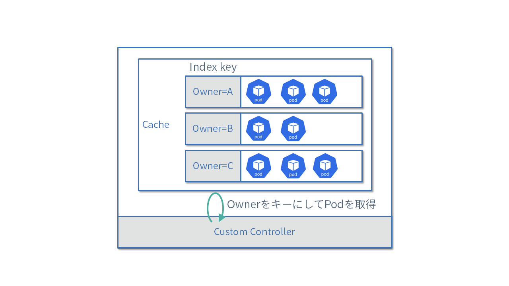

# Manager

[Manager](https://pkg.go.dev/sigs.k8s.io/controller-runtime/pkg/manager?tab=doc#Manager)は、
複数のコントローラを管理し、リーダー選出機能やメトリクスやヘルスチェックサーバーなどの機能を提供します。

すでにこれまでManagerのいくつかの機能を紹介してきましたが、他にもたくさんの便利な機能を持ってるのでここで紹介していきます。

## Leader Election

カスタムコントローラの可用性を向上させたい場合、Deploymentの機能を利用してカスタムコントローラのPodを複数個立ち上げます。
しかし、Reconcile処理が同じリソースに対して何らかの処理を実行した場合、競合が発生してしまうかもしれません。

そこで、Managerはリーダー選出機能を提供しています。
これにより複数のプロセスの中から1つだけリーダーを選出し、リーダーに選ばれたプロセスだけがReconcile処理を実行できるようになります。

リーダー選出の利用方法は、`NewManager`のオプションの`LeaderElection`にtrueを指定し、`LeaderElectionID`にリーダー選出用のIDを指定するだけです。
リーダー選出は、同じ`LeaderElectionID`を指定したプロセスの中から一つだけリーダーを選ぶという挙動になります。

[import:"new-manager",unindent:"true"](../../codes/markdown-viewer/main.go)

それでは、[config/manager/manager.yaml](../../codes/markdown-viewer/config/manager/manager.yaml)の`replicas`フィールドを2に変更して、MarkdownViewコントローラをデプロイしてみましょう。

デプロイされた2つのPodのログを表示させてみると、リーダーに選出された方のPodだけがReconcile処理をおこなっている様子が確認できると思います。

リーダー選出の機能にはConfigMapが利用されています。
下記のようにConfigMapを表示させてみると、`metadata.annotations["control-plane.alpha.kubernetes.io/leader"]`に、現在のリーダーの情報が保存されていることがわかります。

```
$ kubectl get configmap -n markdown-viewer-system c124e721.zoetrope.github.io -o yaml
apiVersion: v1
kind: ConfigMap
metadata:
  annotations:
    control-plane.alpha.kubernetes.io/leader: '{"holderIdentity":"markdown-viewer-controller-manager-87dcb5f6-7ql9f_ece9f1fd-d5e0-4f10-9627-f6214ed9af8a","leaseDurationSeconds":15,"acquireTime":"2021-07-24T06:41:44Z","renewTime":"2021-07-24T10:33:47Z","leaderTransitions":1}'
  creationTimestamp: "2021-07-24T05:56:03Z"
  name: c124e721.zoetrope.github.io
  namespace: markdown-viewer-system
  resourceVersion: "64771"
  uid: d47a3dba-988b-4839-804f-2b6f0ac9c9c1
```

なお、Admission Webhook処理は競合の心配がないため、リーダーではないプロセスも呼び出されます。

## Runnable

カスタムコントローラの実装において、Reconcile Loop以外にもgoroutineを立ち上げて定期的に実行したり、何らかのイベントを待ち受けたりしたい場合があります。
Managerではそのような処理を実現するための仕組みを提供しています。

例えばTopoLVMでは、定期的なメトリクスの収集やgRPCサーバの起動用にRunnableを利用しています。

- [https://github.com/topolvm/topolvm/tree/main/runners](https://github.com/topolvm/topolvm/tree/main/runners)

Runnable機能を利用するためには、[Runnable](https://pkg.go.dev/sigs.k8s.io/controller-runtime/pkg/manager?tab=doc#Runnable)インタフェースを実装した以下のようなコードを用意します。
ここでは10秒周期で何らかの処理をおこなうRunnerを実装しています。

```go
package runners

import (
    "context"
    "fmt"
    "time"
)

type Runner struct {
}

func (r Runner) Start(ctx context.Context) error {
    ticker := time.NewTicker(10 * time.Second)
    defer ticker.Stop()
    for {
        select {
        case <-ctx.Done():
            return ctx.Err()
        case <-ticker.C:
            fmt.Println("run something")
        }
    }
}

func (r Runner) NeedLeaderElection() bool {
    return true
}
```

StartメソッドはManagerのStartを呼び出した際に、goroutineとして呼び出されます。
引数の`context`によりManagerからの終了通知を受け取ることができます。

```go
err = mgr.Add(&runners.Runner{})
```

なお、このRunnerの処理は通常リーダーとして動作している Manager でしか動きません。
リーダーでなくても常時動かしたい処理である場合、[LeaderElectionRunnable](https://pkg.go.dev/sigs.k8s.io/controller-runtime/pkg/manager?tab=doc#LeaderElectionRunnable)インタフェースを実装し、
NeedLeaderElectionメソッドで `false` を返すようにします。

## EventRecorder

カスタムリソースのStatusには、現在の状態が保存されています。
一方、これまでどのような処理が実施されてきたのかを記録したい場合、Kubernetesが提供する[Event](https://pkg.go.dev/k8s.io/api/core/v1?tab=doc#Event)リソースを利用することができます。

Managerはイベントを記録するための機能を提供しており、以下のように取得することができます。

```go
recorder := mgr.GetEventRecorderFor("markdownview-controller")
```

この[EventRecorder](https://pkg.go.dev/k8s.io/client-go/tools/record?tab=doc#EventRecorder)をReconcilerに渡して利用します。

Eventを記録するための関数として、`Event`, `Eventf`, `AnnotatedEventf`などが用意されています。
ここでは、ステータス更新時に以下のようなイベントを記録することにしましょう。なお、イベントタイプには`EventTypeNormal`, `EventTypeWarning`のみ指定することができます。

```go
r.Recorder.Event(&mdView, corev1.EventTypeNormal, "Updated", fmt.Sprintf("MarkdownView(%s:%s) updated: %s", mdView.Namespace, mdView.Name, mdView.Status))
```

このEventリソースは第1引数で指定したリソースに結びいており、そのリソースと同じnamespaceにEventリソースが作成されます。
カスタムコントローラがEventリソースを作成できるように、以下のようなRBACのマーカーを追加し、`make manifests`でマニフェストを更新しておきます。

```go
//+kubebuilder:rbac:groups=core,resources=events,verbs=create;update;patch
```

それでは作成されたEventリソースを確認してみましょう。なお、Eventリソースはデフォルト設定では1時間経つと消えてしまいます。

```
$ kubectl get events -n default
LAST SEEN   TYPE     REASON    OBJECT                             MESSAGE
14s         Normal   Updated   markdownview/markdownview-sample   MarkdownView(default:markdownview-sample) updated: NotReady
13s         Normal   Updated   markdownview/markdownview-sample   MarkdownView(default:markdownview-sample) updated: Healthy
```

## HealthProbe

Managerには、ヘルスチェック用のAPIのエンドポイントを作成する機能が用意されています。

ヘルスチェック機能を利用するには、Managerの作成時に`HealthProbeBindAddress`でエンドポイントのアドレスを指定します。

[import:"new-manager",unindent:"true"](../../codes/markdown-viewer/main.go)

そして、`AddHealthzCheck`と`AddReadyzCheck`で、ハンドラの登録をおこないます。
デフォルトでは`healthz.Ping`という何もしない関数を利用していますが、独自の関数を登録することも可能です。

[import:"health",unindent:"true"](../../codes/markdown-viewer/main.go)

カスタムコントローラのマニフェストでは、このヘルスチェックAPIを`livenessProbe`と`readinessProbe`として利用するように指定されています。

[import:"probe",unindent:"true"](../../codes/markdown-viewer/config/manager/manager.yaml)

## FieldIndexer

複数のリソースを取得する際にラベルやnamespaceだけでなく、特定のフィールドの値に応じてフィルタリングしたいことがあるかと思います。
controller-runtimeではインメモリキャッシュにインデックスを張る仕組みが用意されています。



インデックスを利用するためには事前に`GetFieldIndexer().IndexField()`を利用して、どのフィールドの値に基づいてインデックスを張るのかを指定しておきます。
下記の例ではnamespaceリソースに対して、ownerReferenceに指定されているTenantリソースの名前に応じてインデックスを作成しています。

[import:"indexer"](../../codes/tenant/controllers/tenant_controller.go)
[import:"index-field",unindent:"true"](../../codes/tenant/controllers/tenant_controller.go)

フィールド名には、どのフィールドを利用してインデックスを張っているのかを示す文字列を指定します。
実際にインデックスに利用しているフィールドのパスと一致していなくても問題はないのですが、なるべく一致させたほうが可読性がよくなるのでおすすめです。
なおインデックスはGVKごとに作成されるので、異なるタイプのリソース間でフィールド名が同じになっても問題ありません。
またnamespaceスコープのリソースの場合は、内部的にフィールド名にnamespace名を付与して管理しているので、明示的にフィールド名にnamespaceを含める必要はありません。
インデクサーが返す値はスライスになっていることから分かるように、複数の値にマッチするようにインデックスを構成することも可能です。

上記のようなインデックスを作成しておくと、`List()`を呼び出す際に特定のフィールドが指定した値と一致するリソースだけを取得することができます。
例えば以下の例であれば、ownerReferenceに指定したTenantリソースがセットされているnamespaceだけを取得することができます。

[import:"matching-fields",unindent:"true"](../../codes/tenant/controllers/tenant_controller.go)
